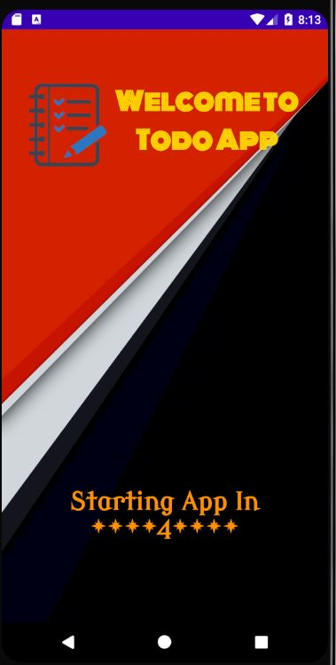
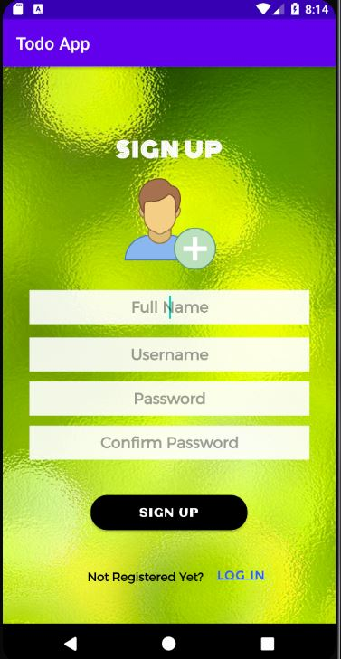
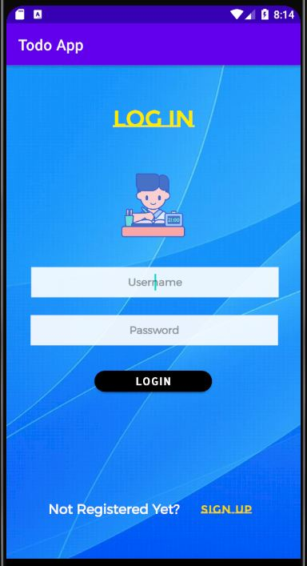
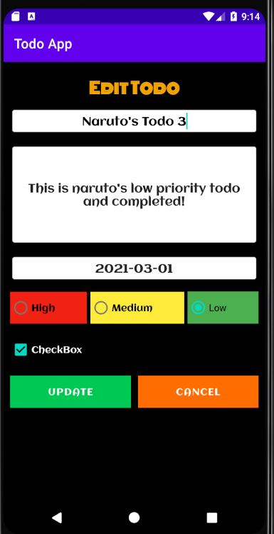
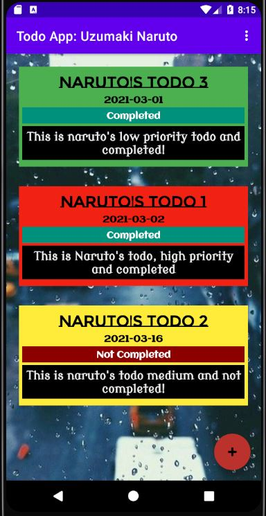
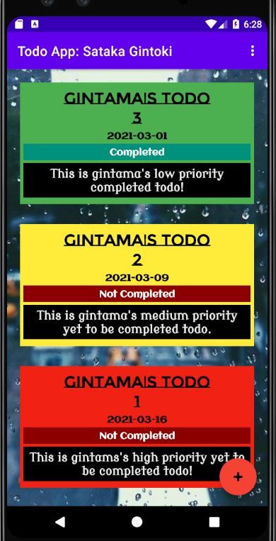
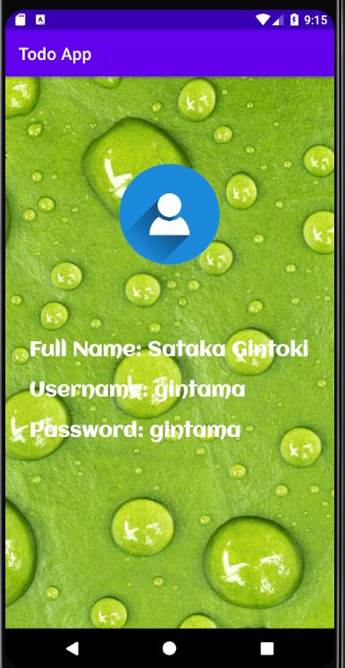

# DMATODOAppC7202634

<h1 style="color:#1089ff;padding:5px;">TodoApp</h1>
<ul style="padding:10px;background:#d8ac9c;color:#1b2021">
  <li>Splash screen with a countdown timer of 5 seconds.  

</li>
    <li>Sign Up as a new User.  

</li>
    <li>Login with valid credentials (username and password). 

</li>
    <li>Input Fields are validated while signing in and loggin in.</li>
    <li>After Login, todo list specific to the logged in user is displayed in the homepage.</li>
    <li>In todo list, todo title, date, description, completed status and priority are displayed. 

 
 

</li>
    <li>Individual todos can be deleted by swiping.</li>
  <li>User Profile can be visited through menu.  

</li>
    <li>Completed Todos can be deleted through menu.</li>
    <li>All todos can be deleted through menu.</li>

</ul>

